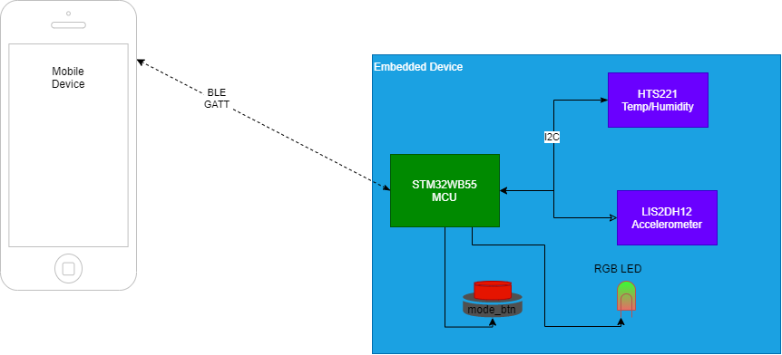
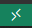

Examples
========

This page just provides some reference examples for different rst directives. For more visit https://docutils.sourceforge.io/docs/ref/rst/directives.html

*italic*

**bold**

`link  <http://up-rev.com>`_

Admonitions
-----------

There are many Admonitions available ("attention", "caution", "danger", "error", "hint", "important", "note", "tip", "warning", "admonition")

.. tip:: Tip of the day!
    
.. note:: This is an example of a note

.. warning:: this is a warning 

Code Snippets
-------------

syntax for many useful languages (c,javascript,python, bash, yaml, json, xml, json, etc)

.. code:: c 
    :number-lines: 1

    #include <stdio.h>

    int main() {
        printf("Hello, World!");
        return 0;
    }

.. code:: yaml

    ---
    doe: "a deer, a female deer"
    ray: "a drop of golden sun"
    pi: 3.14159
    xmas: true
    french-hens: 3
    calling-birds:
        - huey
        - dewey
        - louie
        - fred
    xmas-fifth-day:
    calling-birds: four
    french-hens: 3
    golden-rings: 5
    partridges:
        count: 1
        location: "a pear tree"
    turtle-doves: two
    

Images
------

The 'image' and 'figure' directives allow you to insert images into your document. This also works with '.dio.png' files from draw.io 

    using 'figure' directive instead of 'image' lets you add a caption 

If you need to put an image inline with text or in a table, you can create an alias block. This is useful for showing buttons to click in instructions:

"To open the project in a devcontainer, click the remote window button |pic1|. "

Math 
----

.. math::

    n_{\mathrm{offset}} = \sum_{k=0}^{N-1} s_k n_k

Tables 
------

There are several ways to create a table. If the data already exists in another document, it can be converted to rSt format at `tableconvert.com <https://tableconvert.com/excel-to-restructuredtext>`_

Method 1 

+------------+------------+-----------+
| Header 1   | Header 2   | Header 3  |
+============+============+===========+
| body row 1 | column 2   | column 3  |
+------------+------------+-----------+
| body row 2 | Cells may span columns.|
+------------+------------+-----------+
| body row 3 | Cells may  | - Cells   |
+------------+ span rows. | - contain |
| body row 4 |            | - blocks. |
+------------+------------+-----------+

.. tip:: Method 1 is a little tedious to write out, but it is the most flexible for row/column spans.

Method 2 

=====  =====  ======
   Inputs     Output
------------  ------
  A      B    A or B
=====  =====  ======
False  False  False
True   False  True
=====  =====  ======

CSV tables 

.. csv-table:: a title
   :header: "name", "firstname", "age"
   :widths: 20, 20, 10

   "Smith", "John", 40
   "Smith", "John, Junior", 20

List tables 

.. list-table:: Frozen Delights!
   :widths: 15 10 30
   :header-rows: 1

   * - Treat
     - Quantity
     - Description
   * - Albatross
     - 2.99
     - On a stick!
   * - Crunchy Frog
     - 1.49
     - If we took the bones out, it wouldn't be
       crunchy, now would it?
   * - Gannet Ripple
     - 1.99
     - On a stick!

UML 
---

UML can be done inline, or with an external `.puml` file. Plantuml is very useful for a lot of different diagram types such as sequence, timing, class, use case, state machines, network and many others. For more information and examples see their website `Plantuml.com <https://plantuml.com/sequence-diagram>`_

.. uml:: 

    @startuml
    start
    if (condition A) then (yes)
    :Text 1;
    elseif (condition B) then (yes)
    :Text 2;
    stop
    (no) elseif (condition C) then (yes)
    :Text 3;
    (no) elseif (condition D) then (yes)
    :Text 4;
    else (nothing)
    :Text else;
    endif
    stop
    @enduml

.. uml:: ../assets/diagrams/button.puml

.. uml:: ../assets/diagrams/led.puml
